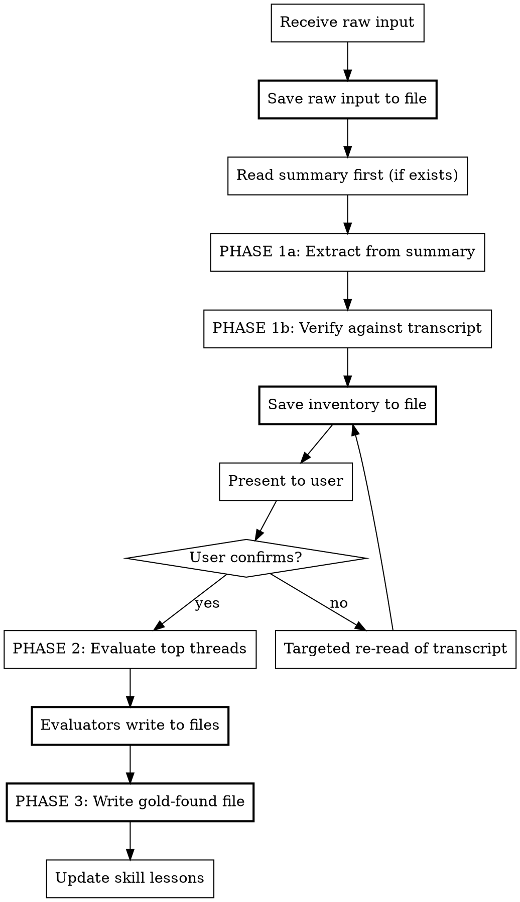

# Panning for Gold

## Overview

Transform raw brain dumps into evaluated, actionable idea inventories. Three phases: **Extract** every thread without filtering, **Evaluate** the highest-signal ones, then **Synthesize** into a permanent gold-found file.

**Core principle:** Every line gets examined. Nothing is dismissed as noise on the first pass. Personal threads, half-formed thoughts, and tangential observations often contain the highest-signal ideas.

## When to Use

- Voice transcripts (multi-speaker, timestamped)
- Stream-of-consciousness notes
- Brain dump markdown exports from ChatGPT/Gemini/Claude
- Any document where the user says "process this" or "what's in here"
- Multi-topic conversations that need thread extraction

## Critical Rules (Learned from Production Use)

These rules exist because they've been violated and caused wasted work:

1. **SAVE EVERYTHING TO PERMANENT FILES.** Phase 1 inventory, Phase 2 evaluations, and Phase 3 synthesis ALL get saved to files in the project's docs directory. Never rely on agent memory or temp task outputs surviving compaction.

2. **SUMMARIES FIRST, TRANSCRIPT SECOND.** If a summary/notes file exists alongside a transcript, use the summary as the primary extraction source. Only read the full transcript for: (a) exact quotes to support threads, (b) verifying completeness on the second pass. This saves 10-20K tokens per scan.

3. **EVALUATORS WRITE TO FILES.** Every background evaluator agent MUST write its evaluation to a permanent file (e.g., `docs/meetings/evaluations/YYYY-MM-DD-{slug}.md`) as part of its task. Do not depend on collecting agent return values.

4. **SYNTHESIS HAPPENS INLINE.** Do not dispatch a separate agent for synthesis. Write the gold-found file yourself after evaluators finish. If evaluators disappear (compaction, task ID loss), write the synthesis from your own reading.

5. **TWO PASSES ON TRANSCRIPTS.** Always run Phase 1 twice. First pass uses summary + targeted transcript reads. Second pass is a verification scan for missed threads. Present both inventories merged.

## Process



## Phase 0: Save Raw Input

**BEFORE ANY ANALYSIS:** Save the raw transcript/brain dump to a file if it's not already saved. Order: save first, analyze second. This rule exists because of two violations in a single session (2026-03-13).

File naming: `docs/meetings/YYYY-MM-DD-{source}-transcript.md` or `docs/brainstorming/YYYY-MM-DD-{topic}.md`

## Phase 0.5: Speaker Consolidation & Identification (Multi-Speaker Transcripts Only)

**BEFORE EXTRACTING THREADS:** Clean the speaker data. Voice transcripts with auto-generated speaker labels are actively misleading, not just unreliable. This is a data quality problem that must be solved before any analysis.

### Why This Exists

Added 2026-03-18 after a lunch meeting transcript: 10 speaker labels were generated for a 2-person conversation. The same person got different labels across scenes (office, car, restaurant), and different people shared labels. 40+ threads were attributed to the wrong person, turning pain points into pitches and vice versa. The entire inventory had to be re-done.

### The Problem (Quantified)

Typical voice transcription software (Otter, Plaud, phone recording apps) re-assigns speaker labels when:
- **Environment changes** (office to hallway to car to restaurant)
- **Background noise shifts** (quiet room vs. loud restaurant)
- **Volume/distance changes** (close mic vs. across table)
- **Brief pauses or interruptions** (any silence can trigger a new "speaker")

Result: A 2-person lunch meeting generated 10 speaker labels. Speaker 5 was attributed to BOTH participants at different points. The labels are worse than useless, they're actively wrong.

### Process

#### Step 1: Ask the user FIRST (10 seconds, saves 30 minutes)

Before reading a single line of transcript:
- "Who was present?"
- "Any other people who spoke briefly?" (receptionist, waiter, etc.)
- "What was the setting?" (helps predict environment-change label swaps)

#### Step 2: Speaker Label Audit (automated)

Run a quick frequency analysis on the raw transcript:

```
Count lines per speaker label
Sample 2-3 lines from each label
Compare: expected speakers vs. actual labels
```

If `number_of_labels > (expected_speakers * 2)`, the labels are fragmented and CANNOT be trusted for attribution. Flag this immediately.

#### Step 3: Build Anchor Lines

From memory, CRM, and context, identify "unmistakable" lines per person. These are lines that could ONLY have been said by one specific person:

**Your anchors (stable across all transcripts):**
- References to family members by name
- Your specific projects, tools, or frameworks
- Career history details only you would mention
- Hobby or interest references unique to you

**Other speaker anchors (build per-meeting):**
- Workplace-specific vocabulary ("our patients", "our census")
- System knowledge (specific internal tools only they would reference)
- Budget/operational details only an insider would know
- Personal anecdotes or stories unique to them

#### Step 4: Scene-Based Re-Attribution

Instead of trusting speaker labels, segment the transcript by SCENE (environment change). Within each scene:
1. Identify the anchor lines (unmistakable attribution)
2. Use conversational flow (questions vs. answers, topic expertise) to attribute the rest
3. Mark confidence: HIGH / MEDIUM / LOW

Scenes typically break at: location changes, long pauses, topic resets, new people entering.

#### Step 5: Batch Clarification

Collect all MEDIUM and LOW attributions into ONE numbered list. Present to user. Get all corrections in a single pass.

#### Step 6: Produce Clean Transcript (Optional but recommended for high-value meetings)

If the meeting is high-value (potential deal, important relationship), produce a cleaned version with consolidated speaker names replacing label numbers. Save as `YYYY-MM-DD-{source}-clean-transcript.md`. This becomes the canonical reference.

### Decision: Is Re-Extraction Needed?

After attribution corrections, assess:
- If >20% of threads change meaning with correct attribution: **re-extract from scratch**
- If <20% but key pain-point threads are affected: **targeted fixes to inventory**
- If corrections are mostly cosmetic (personal threads, food discussions): **fix in place, proceed to evaluation**

## Phase 1: Extract (Pan)

### Token-Efficient Reading Strategy

1. **If a summary/notes file exists alongside the transcript:** Read the summary FIRST. Extract all threads from it. This covers 80-90% of content in ~200 lines instead of ~900.
2. **Then targeted transcript reads:** For each summary thread, pull ONE exact quote from the transcript (use Grep to find it, don't read the whole file).
3. **Second pass verification:** Read the last 30% of the transcript (conversations front-load business, end with personal/relationship threads that summaries often skip).

### Extraction Rules

1. **Read every line.** Voice transcripts have ideas buried in small talk. A massage therapy conversation might contain a warm intro to a key business contact.
2. **No category filtering.** Extract personal, professional, technical, creative, wellness, financial, relational threads equally. You don't decide what matters, the user does.
3. **Context is signal.** "I should have talked to her first" is a strategic insight, not filler. "This wrist has been hurting" next to "I carry both kids" is a biomechanics thread.
4. **Tangents are features.** Stream-of-consciousness thinking links ideas the user hasn't consciously connected yet. Note the connections.
5. **Transcription artifacts are clues.** Garbled speech, speaker changes, and interruptions mark moments of excitement or distraction, both worth capturing.

### What to Extract

For each thread, capture:
- **The idea** (1-2 sentences)
- **Exact quote** from the source (so the user can remember the moment)
- **Implicit connections** to other threads or known projects
- **Category** (don't filter by category, but label for organization)

### Save the Inventory

**IMMEDIATELY** save the Phase 1 inventory to `docs/meetings/YYYY-MM-DD-{source}-inventory.md` or equivalent. This file survives compaction even if nothing else does.

### Present the Inventory

Show ALL threads in a numbered list, grouped by category but with EVERY category represented. Include a count. Ask the user: "I found N threads. Does that feel complete, or did I miss something?"

**If the user says you missed things:** Do a targeted re-read of specific transcript sections. Do NOT re-read the entire transcript (token waste). Ask: "Which topic area feels thin?"

## Phase 2: Evaluate (Brainstorm per Nugget)

### Triage First

NOT every thread needs a full evaluation agent. Categorize threads:
- **ACT NOW candidates (3-5 max):** Get full evaluation (Opus agent or inline)
- **Already validated:** Threads that confirm things from prior sessions. Note them, skip evaluation.
- **PARK candidates:** Threads with clear "not now" signals. One-line verdict, no agent.

### Evaluation Approach (Efficiency-Ranked)

1. **Inline evaluation (preferred for 1-3 threads):** Write the evaluation yourself in the gold-found file. Fastest, no agent overhead, no risk of lost work.
2. **Background agents (for 4+ ACT NOW threads):** Dispatch agents BUT require them to write to permanent files.
3. **NEVER dispatch more than 5 background evaluators.** If you have more than 5 ACT NOW candidates, you miscategorized. Re-triage.

### Per-Idea Evaluation Template

```
You are brainstorming about a single idea extracted from a brain dump.

IDEA: {idea description}
CONTEXT: {surrounding context from transcript}
USER'S CONTEXT: {call search_thoughts("keywords from the idea") to find related prior thinking}

IMPORTANT: Write your evaluation to {output_file_path} using the Write tool before returning.

Evaluate this idea thoroughly:

1. **What is this really?** Restate the idea in its strongest form.
2. **Why did this excite them?** What need or desire does it serve?
3. **Build vs Buy:** Does something already exist? Search GitHub. What's the delta?
4. **Feasibility:** How hard is this? Time estimate. Dependencies.
5. **Connections:** How does this connect to their existing thinking? (Use search_thoughts to find related Open Brain entries.)
6. **Verdict:** One of:
   - ACT NOW (high value, low effort, unblocks something)
   - RESEARCH MORE (promising but needs investigation)
   - PARK IT (interesting but not timely)
   - KILL IT (not worth attention, explain why)
7. **If ACT NOW or RESEARCH MORE:** What are the next 3 concrete actions?

Be honest. Don't inflate value. Don't dismiss things as "someday" just because they're not code.
```

### Agent Configuration

- Use `run_in_background: true` for all evaluators
- **Every evaluator MUST include instructions to write output to a permanent file**
- Use Opus (`model: opus`) for ideas that connect to SHIP projects or involve strategic decisions
- Use Sonnet for lower-stakes research (hardware, consumer products, wellness)
- Use Haiku for quick feasibility checks (does an API exist? is this legal?)
- Output path: `docs/meetings/evaluations/YYYY-MM-DD-{idea-slug}.md`

## Phase 3: Synthesis

Write the gold-found file **yourself** (do not delegate to an agent). Collect from:
1. Evaluation files written by agents (if they succeeded)
2. Your own inline evaluations
3. Your Phase 1 inventory for threads that didn't need full evaluation

### Gold-Found File Location

`docs/meetings/YYYY-MM-DD-{source}-gold-found.md`

### Summary Format

```markdown
# Gold Found: {date} {source}

**Source:** {transcript/brain dump description}
**Extraction method:** {summary-first + transcript verification / full read / etc.}
**Thread count:** {N}

---

## ACT NOW
{Full evaluation for each, with evidence quotes and next 3 actions}

## RESEARCH MORE
| # | Idea | Question to Answer | Next Action |

## PARKED (No guilt, no deadlines)
| # | Idea | Why Interesting | Trigger to Revisit |

## KILLED
| # | Idea | Why Not |

## Connections Discovered
- {idea A} connects to {idea B} because...
- {thread from transcript} validates {existing project assumption}

## Mary's Law Check
Is there a human the user should contact before writing more code?

## New COS Items
### WAITING_FOR
### Calendar
### CRM Updates
### Decisions
```

## Phase 3.5: Capture to Open Brain

After writing the gold-found file, capture to Open Brain automatically (do not ask).

> **Note:** If you have the [Auto-Capture Protocol](../auto-capture-protocol/) recipe installed, it handles session-end captures automatically. This phase still runs because panning-specific captures (per-thread ACT NOW items) are more granular than session summaries.

1. **Each ACT NOW item** gets its own `capture_thought`:
   - `content`: "ACT NOW: [one-line summary]. [Full evaluation: verdict, connections, next actions]. Origin: [transcript file path] > [gold-found file path] > Thread #N"

2. **Session summary** as one `capture_thought`:
   - `content`: "Panning session: [source], [N] threads, [M] ACT NOW, [K] RESEARCH MORE. Threads: [all thread titles + categories]. Gold-found: [file path]"

This closes the flywheel: panning extracts and evaluates, OB1 stores, Gate 0 finds it next session.

## Phase 4: Self-Improvement

After every panning session, check:
1. **Did any work get lost?** (agents died, compaction ate something, files not saved) -> Add a rule to Critical Rules section
2. **Was token usage reasonable?** (did we re-read unnecessarily, dispatch too many agents?) -> Update the reading strategy
3. **Did the user correct the extraction?** (missed threads, wrong categorization) -> Add to Common Mistakes

If any lesson is learned, update this skill file directly. The skill improves with every use.

### Lessons Log

| Date | Lesson | Change Made |
|------|--------|-------------|
| 2026-03-13 | Background evaluator agents lost to compaction. Synthesis never written. | Added Critical Rules 1-4. Evaluators must write to permanent files. Synthesis done inline. |
| 2026-03-13 | Re-reading 926-line transcript burned ~30K tokens when Fathom summary covered 90% | Added "Summaries First" strategy. Use Grep for quotes instead of full re-reads. |
| 2026-03-13 | Phase 1 inventory not saved to file, lost on compaction | Added Phase 1 "Save the Inventory" step with permanent file. |
| 2026-03-18 | 10 speaker labels generated for 2-person conversation. Labels are WORSE than useless, they actively mislead. Same person gets different labels across environments, different people share labels. | Added Phase 0.5: Speaker Consolidation & Identification. Must clean speaker data before ANY thread extraction. Ask user who was present FIRST. |
| 2026-03-18 | Voice labels swapped between two speakers caused 40+ threads to be misattributed. Pain points became pitches and vice versa. | Phase 0.5 now includes anchor-line identification, scene-based re-attribution, and a decision framework for whether re-extraction is needed. |
| 2026-03-18 | "Don't be stingy with the extract" - first pass had 42 threads, expanded to 82 after user pushed back. Collapsing related threads and skipping "non-business" categories loses signal. | Added to Common Mistakes. Default to over-extraction, let Phase 2 triage handle prioritization. |

## Red Flags: You're Rushing

| Thought | Reality |
|---------|---------|
| "This section is just small talk" | Small talk contains relationship signals and warm intros |
| "This isn't actionable" | Not everything needs to be a JIRA ticket to be valuable |
| "I'll focus on the tech ideas" | The user said EVERY idea. Tech bias is the #1 failure mode |
| "I can summarize this section" | You're skimming. Read every line. |
| "This is too long to read carefully" | That's exactly why the user asked YOU to do it |
| "Personal/wellness isn't relevant" | The user's body, relationships, and energy ARE the system |

## Red Flags: You're Wasting Tokens

| Thought | Reality |
|---------|---------|
| "Let me read the full transcript again" | Did you check if a summary exists first? Use Grep for quotes. |
| "I'll dispatch 8 evaluator agents" | More than 5 means you miscategorized. Re-triage. |
| "I'll have an agent write the synthesis" | Write it yourself. Agents disappear. |
| "Let me re-read to find that quote" | Use Grep with a keyword from the thread. 100x cheaper. |
| "I need to read the whole file for context" | Read the first 50 and last 50 lines. Middle is usually elaboration, not new threads. |

## Common Mistakes

1. **Filtering by your assumptions about "actionable."** A massage therapist knowing a law firm owner IS actionable, it's a warm intro worth more than 100 lines of code.
2. **Speed over thoroughness.** Brain dumps reward slow reading. The gold is in the tangents.
3. **Collapsing related threads.** "CBD for massage" and "CBD for Sam's migraines" are TWO ideas, not one. Keep them separate, they have different evaluations.
4. **Ignoring meta-observations.** When someone says "maybe I should just record and process later," that's a workflow insight, not filler.
5. **Not asking if you missed threads.** Always ask. You probably did.
6. **Not saving intermediate work.** Every output (inventory, evaluations, synthesis) gets a permanent file. If it's not on disk, it doesn't exist.
7. **Re-reading the whole transcript for one quote.** Use Grep. It's 100x cheaper.
8. **Dispatching agents and hoping they return.** Agents are unreliable across compaction boundaries. For critical synthesis, do it inline.
9. **Trusting auto-generated speaker labels.** Voice transcription software creates 3-5x more speaker labels than actual speakers. Labels shift with environment changes. NEVER use speaker numbers as ground truth, always verify with anchor phrases and conversational context.
10. **Being stingy on first extraction.** Default to over-extraction (80+ threads for a 1-hour conversation is normal). Phase 2 triage handles prioritization. Phase 1's job is completeness, not curation. If your first pass has fewer than 40 threads for a 30+ minute multi-topic conversation, you're collapsing or skipping.
